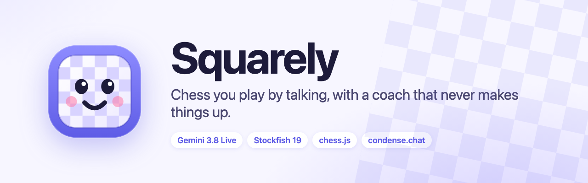
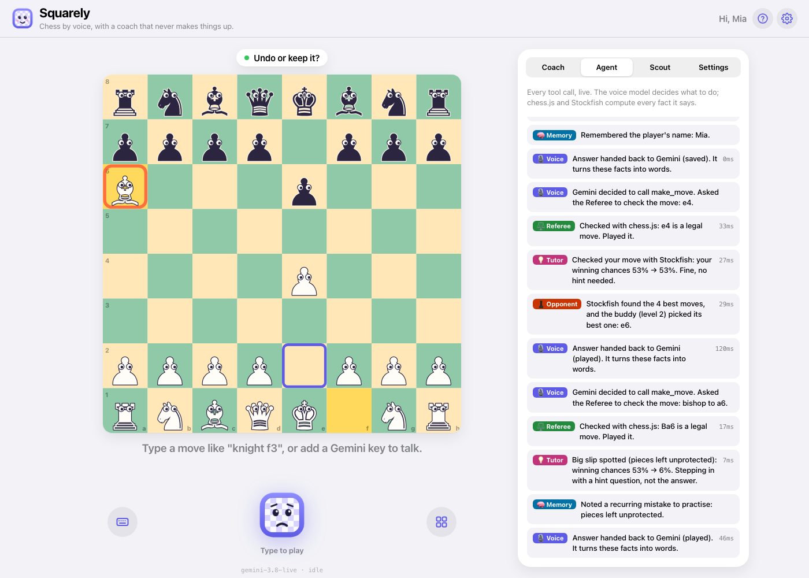
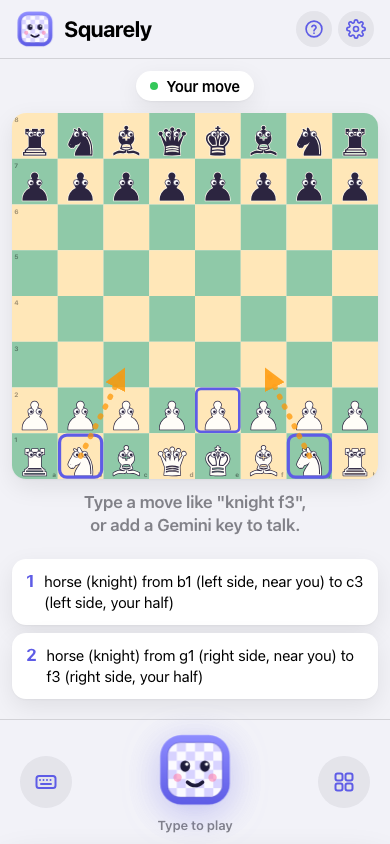
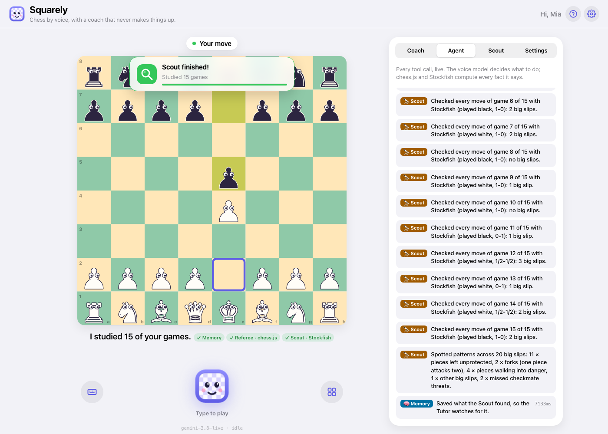
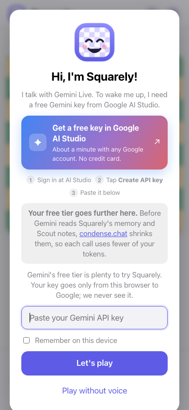
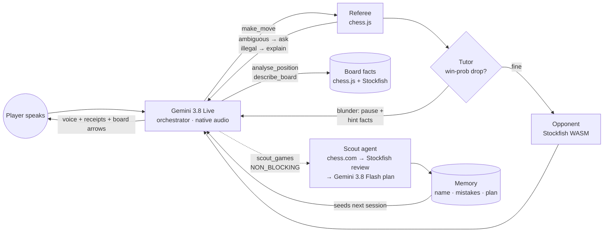

<p align="center"></p>

# Squarely

**Chess you play by talking, with a coach that never makes things up.**

Live: **https://squarely-chess.vercel.app**. Bring your own Gemini key; it goes straight from your browser to Google.

Squarely is a voice-first chess partner for anyone who has nobody to play and practise with: a kid at home after chess club, a beginner, a grown-up who wants a sparring partner. You talk to it like a friend ("move my horse to the middle", "what's attacking me?", "undo that"). It plays back at your level, asks you questions when you blunder instead of handing you the answer, and studies your online games to find what you keep getting wrong.

It's kid-friendly by default, with a kids-mode toggle, and accessible out of the box: you never need to see the board, so blind and low-vision players can play eyes-closed.

Built in one day at the {Tech: Europe} × Google DeepMind Agentic AI Hack, Stockholm, 3 October 2026.

<table>
  <tr>
    <td width="62%"></td>
    <td></td>
  </tr>
  <tr>
    <td><sub><b>The tutor steps in.</b> Bishop to a6 drops the bishop (Stockfish: winning chances 53% → 6%). Squarely pauses, highlights the piece and asks a question instead of giving the answer. The agent log on the right shows every step in plain English.</sub></td>
    <td><sub><b>It asks instead of guessing.</b> "Move my horse to the middle" fits two moves, so it points at both and reads the options out loud.</sub></td>
  </tr>
  <tr>
    <td></td>
    <td></td>
  </tr>
  <tr>
    <td><sub><b>The Scout works in the background.</b> Say your chess.com name and a second agent fetches your games, checks every move with Stockfish and finds your recurring mistakes, while you keep playing.</sub></td>
    <td><sub><b>Setup takes a minute.</b> Bring a free Gemini key from Google AI Studio. It goes straight from your browser to Google.</sub></td>
  </tr>
</table>

---

## Why it's different

- **The truth law.** The language model never judges a chess position. Every claim Squarely speaks (a threat, a piece in danger, who is winning, what you did wrong) comes from a tool result that chess.js or Stockfish computed in that turn. Each spoken line shows a **receipt** naming the tool that backs it (e.g. `✓ Tutor · Stockfish`). A chess coach that hallucinates is worse than none, especially for a child.
- **An agent, not a chatbot.** The Gemini Live model decides what to do next. It might play the move, ask "which horse?", pause the game because you just blundered, or send a background agent to study your past games. Code computes every fact it says.
- **Voice-first, for real.** Moves, hints, board reading, undo, new game, colours, piece styles, language, kids mode, parent summary and "forget me" all work by voice. Speak Swedish, Spanish or Hindi and it answers in your language.

## The agent



| Role | Implemented by | What it decides / computes |
|---|---|---|
| **Voice orchestrator** | Gemini 3.8 Live (`gemini-3.8-live`), function calling | What to do next; phrases tool results in the player's language |
| **Referee** | chess.js (`src/chess/resolver.ts`) | Turns "the horse near my king" / "pawn in front of my king, two steps" into exactly one legal move, or asks a clarifying question |
| **Tutor** | Stockfish 19 WASM + chess.js (`src/chess/motifs.ts`) | Spots blunders by win-probability drop, classifies them (fork, hanging piece, piece in danger incl. discovered attacks, mate threat) and pauses the game with hint facts, at most once every 3 moves |
| **Opponent** | Stockfish 19 WASM (`src/engine/stockfish.ts`) | MultiPV + softmax over centipawn loss, so level 1 really does let you win sometimes |
| **Scout** | Background agent (`src/scout/scout.ts`) | Fetches your recent chess.com games, reviews every one of your moves on its own engine worker, counts recurring mistakes, then Gemini 3.8 Flash writes a practice plan **from those counts only** |
| **Memory** | localStorage (+ condense.chat) | Name, record, recurring mistakes, Scout plan, compressed notes from past sessions |

**14 tools** (`src/agent/tools.ts`): `make_move`, `engine_reply`, `analyse_position`, `describe_board`, `undo`, `remember`, `game_summary`, `set_level`, `scout_games`, `new_game`, `change_settings`, `show_screen`, `stop_listening`, `forget_me`.

The **Agent** tab shows every tool call live, with the role that handled it and its latency.

## Accessibility

- Eyes-closed play: Squarely always says *where* it moved and reads clarification options aloud. "Read the board", "where is my king?" and "what did you just move?" are all supported.
- Full keyboard play on the board (arrows + Enter), with screen-reader announcements for every move and for the board cursor.
- High-contrast board and big-letter pieces, which you can switch to by voice.
- Dialogs trap focus and close with Escape. Reduced-motion is respected.

## Partner technology (honest usage)

- **Google DeepMind / Gemini API (core).** `gemini-3.8-live` is the real-time voice agent: native audio, barge-in, input and output transcription, function calling with BLOCKING and NON_BLOCKING tools, session resumption and context compression. `gemini-3.8-flash` (structured JSON output, low thinking) writes the Scout's practice plan. Calls go browser → Google with the visitor's own key via `@google/genai`.
- **condense.chat.**
  - Squarely itself was built through condense: the coding agent's traffic ran through the `dense` proxy.
  - In the app, `api/condense.js` (a Vercel function that holds the condense key, since condense blocks browser calls) compresses past conversations into long-term memory that seeds the next Live session. It also compresses the Scout's full annotated mistake log before Gemini reads it. Token savings show under Settings → Memory and in the Agent trace.
  - The in-app integration needs an organisation-tier condense key in `CONDENSE_API_KEY`. Without it, Squarely runs uncompressed.
- **OpenCode / MatrixOS** were not used.

## Run locally

```bash
npm install
npm run dev        # http://localhost:5173
npm run build      # type-check + production build into dist/
```

- Requires Node 20+.
- `npm run dev` and `npm run build` first copy the single-threaded Stockfish build from `node_modules/stockfish` into `public/stockfish/`. It needs no cross-origin-isolation headers, so any static host works.
- Paste a Gemini API key from [Google AI Studio](https://aistudio.google.com/apikey) when the app asks, or choose **Play without voice** to type moves (offline mode drives the same tools with a keyword parser and template replies).
- Optional: set `CONDENSE_API_KEY` in Vercel to switch on condense compression.

### Deploy

```bash
vercel deploy --prod
```

Static Vite build plus one serverless function (`api/condense.js`).

## Project layout

```
src/
  voice/live.ts        Gemini Live session: 16 kHz mic worklet → Live → 24 kHz playback, tool dispatch, resume
  agent/tools.ts       Tool declarations + dispatcher (the agent's whole action surface)
  agent/prompt.ts      System instruction: truth law, kids / grown-up mode, language, memory
  agent/offline.ts     No-network fallback: keyword parser + template phrasing
  game/controller.ts   Game state; Referee, Tutor, Opponent, Memory, Scout orchestration; trace; pointing
  chess/resolver.ts    Kid language → one legal move, or a question
  chess/motifs.ts      Blunder classifier (shared by Tutor and Scout)
  chess/facts.ts       chess.js facts: threats, hanging pieces, plain-language square locations
  engine/stockfish.ts  UCI wrapper over the Stockfish WASM worker (MultiPV, timeouts)
  scout/scout.ts       Background game-review agent
  memory/              localStorage profile + condense client
  ui/                  Board (SVG), Avatar, panels, settings
api/condense.js        Serverless relay to condense.chat
scripts/e2e/           Headless-Chromium end-to-end checks over CDP
```

## Testing

`scripts/e2e/` drives the real app in headless Chromium. It covers:
- Offline tool regressions: ambiguity, settings, race between a voice move and New game, playing black, undo, illegal moves.
- Mate, promotion and castling.
- Live-voice scenarios: the tutor blunder → hint → fix beat, eyes-closed play, every setting by voice, and a Swedish conversation.

See `scripts/e2e/README.md`.

## Tech

Vite + React 19 + TypeScript, chess.js 1.4, Stockfish.js 19 (lite, single-threaded WASM), `@google/genai`, Vercel.

## Credits and licences

- [Stockfish.js](https://github.com/nmrugg/stockfish.js) (GPLv3) by Nathan Rugg / Chess.com, based on [Stockfish](https://github.com/official-stockfish/Stockfish). It's loaded as a separate, unmodified worker file.
- [chess.js](https://github.com/jhlywa/chess.js) (BSD-2).
- Game data from the public [chess.com API](https://www.chess.com/news/view/published-data-api).
