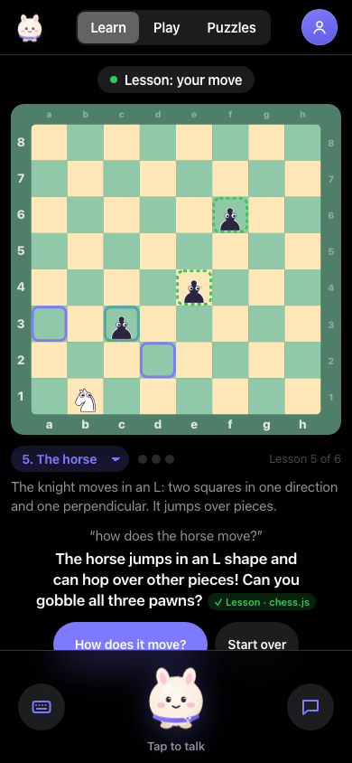
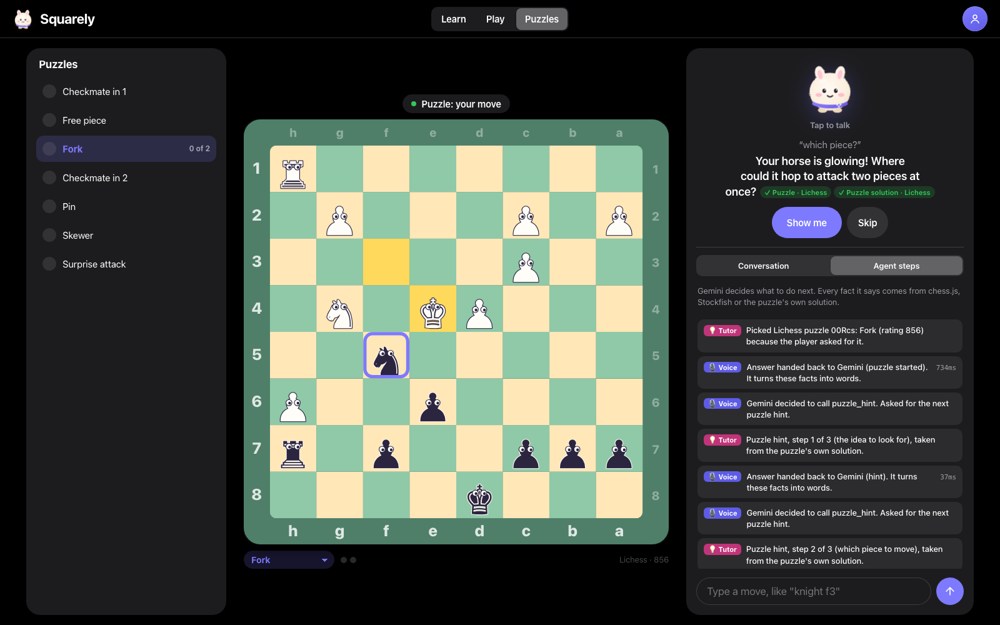
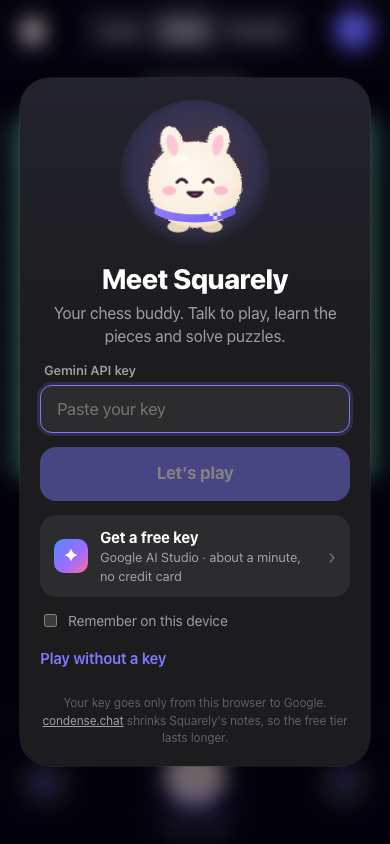
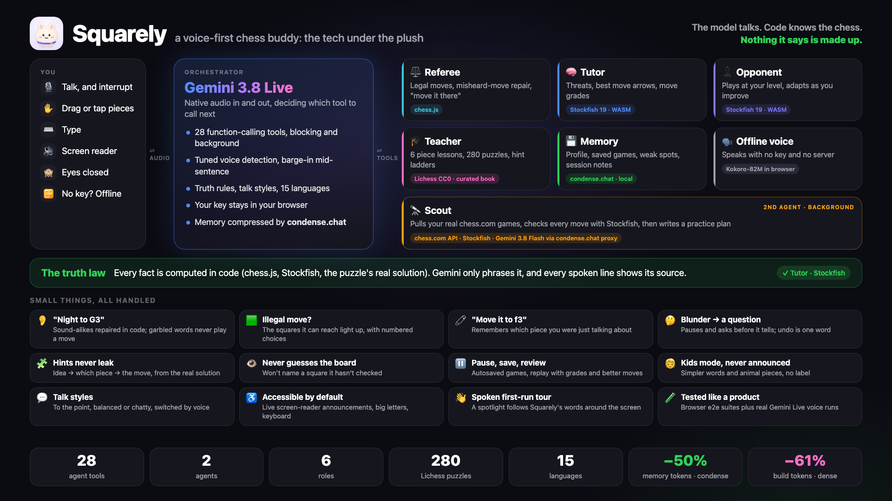
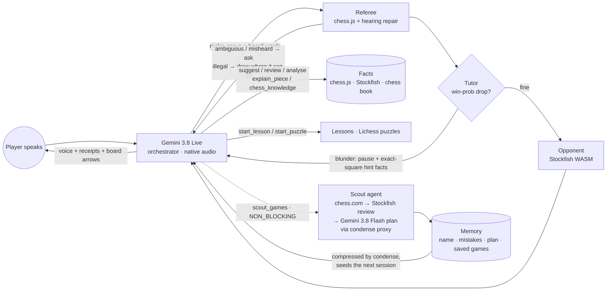

<p align="center"></p>

# Squarely

**Chess you play by talking, with a coach that never makes things up.**

Live: **https://squarely-chess.vercel.app** · Bring your own free Gemini key; it goes straight from your browser to Google.

Squarely is a voice-first chess buddy for anyone with nobody to play and practise with: a complete beginner, a kid after chess club, a grown-up who wants a sparring partner, or someone who can't see the board. You talk to it like a friend ("teach me how the horse moves", "take his castle with my queen", "what's attacking me?", "give me a fork puzzle"). It teaches, plays at your level, pauses and asks a question when you blunder instead of handing you the answer, and studies your online games in the background to find what you keep getting wrong.

Built in one day at the {Tech: Europe} × Google DeepMind Agentic AI Hack, Stockholm, 3 October 2026.

<table>
  <tr>
    <td width="62%"></td>
    <td></td>
  </tr>
  <tr>
    <td><sub><b>The tutor steps in.</b> A blunder drops a piece (Stockfish: winning chances fall sharply). Squarely pauses, highlights the piece and asks a question instead of giving the answer. Every step shows up in the agent log in plain English.</sub></td>
    <td><sub><b>Learn mode for absolute beginners.</b> One piece at a time on an almost empty board: the rule in plain words, where it can go lit up, and a tiny task.</sub></td>
  </tr>
  <tr>
    <td></td>
    <td></td>
  </tr>
  <tr>
    <td><sub><b>Voice puzzles from Lichess.</b> Hints climb a ladder (the idea, then which piece, then the move as a green arrow), all from the puzzle's real solution.</sub></td>
    <td><sub><b>Setup takes a minute.</b> One free key from Google AI Studio, or play without one using an in-browser voice.</sub></td>
  </tr>
</table>

---

## Why it's different

- **The truth law.** The language model never judges a chess position. Every claim Squarely speaks (a threat, a piece in danger, a good move, a grade, a rule) comes from a tool result computed by chess.js, Stockfish, a curated chess book or a puzzle's own solution. Each spoken line carries a **receipt** naming what backs it (`✓ Tutor · Stockfish`). A coach that hallucinates is worse than none, especially for a beginner or a child.
- **An agent, not a chatbot.** Gemini 3.8 Live decides what to do next from 28 tools: play the move, ask "which horse?", pause the game after a blunder, open a lesson, start a puzzle, or send a second agent (the Scout) to study your games while you keep playing.
- **Voice-first, for real.** Everything works by voice: moves, hints, lessons, puzzles, pause and resume, replays, board look, talk style and language. Speech-to-text mistakes are repaired in code ("night to G3" → knight; an impossible move gets "did you mean f3 or h3?" with numbered arrows), and garbled words are never turned into a guessed move.
- **Teaches with eyes and ears.** "What's a good move for my queen?" draws a green arrow; "was that good?" grades the move like chess.com (book, best, great, inaccuracy, mistake, blunder) and shows the better one; "how does the horse move?" draws its moves.

## What you can do

| | |
|---|---|
| **Learn** | Six lessons, castle → bishop → queen → king → horse → pawn, each with a "gobble the pawns" task. Squarely offers lessons (not a game) when someone says they're new. |
| **Play** | Stockfish at 5 levels (it picks weaker moves on purpose at low levels so you can win). Tap, drag or speak moves. Hints, grades, best-move arrows, openings by name. |
| **Puzzles** | 280 kid-friendly Lichess puzzles in 7 themes. With no theme asked, it picks the kind of mistake Memory has seen you make. |
| **Your games** | Every game autosaves; the app reopens where you left off. Pause/resume by voice. Replays step through your moves with grades and the engine's better move drawn. |
| **Scout** | "My chess.com name is …": a background agent fetches your recent games, reviews every move with its own Stockfish worker, finds recurring mistakes, and Gemini 3.8 Flash writes a practice plan from those counts only. |
| **Make it yours** | Talk style (to the point / balanced / chatty), friendly piece names for young players, board colours, piece styles incl. big letters and high contrast, 15 languages. |

## The agent

<p align="center"></p>



| Role | Implemented by | What it decides / computes |
|---|---|---|
| **Voice orchestrator** | Gemini 3.8 Live (`gemini-3.8-live`), function calling | What to do next; phrases tool results in the player's language and talk style |
| **Referee** | chess.js (`src/chess/resolver.ts`, `src/chess/hearing.ts`) | Turns "the horse near my king" or "move it to c4" into exactly one legal move; repairs misheard words; asks instead of guessing |
| **Tutor** | Stockfish 19 WASM + chess.js (`src/chess/motifs.ts`, `teach.ts`) | Blunders by win-probability drop, classified (fork, hanging piece, discovered attack, mate threat) with exact squares and "now vs. after their move"; move grades; best-move arrows |
| **Opponent** | Stockfish 19 WASM (`src/engine/stockfish.ts`) | MultiPV + softmax over centipawn loss, so level 1 really lets you win |
| **Teacher** | `src/chess/lessons.ts`, `knowledge.ts`, `puzzles.ts` | Lessons, a curated chess book (30 openings, 19 tactics and rules), Lichess puzzles with a hint ladder from the real solution |
| **Scout** | Background agent (`src/scout/scout.ts`) | chess.com games → Stockfish review of every move → recurring mistakes → Gemini 3.8 Flash plan (through the condense proxy) |
| **Memory** | localStorage + condense.chat | Name, record, mistakes, Scout plan, saved games, lessons done, compressed notes from past sessions |

**28 tools** (`src/agent/tools.ts`): `make_move`, `engine_reply`, `analyse_position`, `suggest_move`, `review_move`, `chess_knowledge`, `explain_piece`, `describe_board`, `undo`, `new_game`, `set_level`, `start_lesson`, `stop_lesson`, `start_puzzle`, `puzzle_hint`, `stop_puzzle`, `pause_game`, `resume_game`, `open_game`, `review_step`, `stop_review`, `scout_games`, `remember`, `game_summary`, `change_settings`, `show_screen`, `stop_listening`, `forget_me`.

The **Agent steps** tab shows every tool call live, in plain English, with the role that handled it and its latency.

## Partner technology

- **Google DeepMind / Gemini API (core).** `gemini-3.8-live` is the real-time voice agent: native audio, barge-in tuned for kids (fast to interrupt, patient before answering), input/output transcription, BLOCKING and NON_BLOCKING tools with `WHEN_IDLE` scheduling, session resumption and context compression. `gemini-3.8-flash` (structured JSON, low thinking) writes the Scout's practice plan. Calls go browser → Google with the visitor's own key via `@google/genai`.
- **condense.chat.** Three places in the app, plus the build itself:
  1. **Proxy:** the Scout's Gemini Flash call goes through condense's OpenAI-compatible proxy (`X-Condense-Upstream-Url` → Gemini), which compresses the prompt on the way. It falls back to Gemini directly if condense is unavailable.
  2. **Long-term memory:** past conversations are compressed with `/v1/compress` into notes that seed every new Live session's instructions.
  3. **Scout mistake log:** the full annotated log is compressed before Gemini reads it.
  4. **The build:** Squarely was written with a coding agent routed through the `dense` CLI: **481.7M → 188.8M tokens (61% smaller), $109 → $57**.
  - The condense key stays server-side in `api/condense.js` (condense blocks browser calls). Measured in-app savings are below.
- **OpenCode / MatrixOS** were not used.

### Measured token savings (one session)

Measured with `scripts/e2e/live-token-session.js` on 3 October 2026: one real Gemini Live session with 2 short games, 3 puzzles with hints and a Scout run over 15 chess.com games (32 model turns, 29 tool calls).

| | Without condense | With condense | |
|---|---|---|---|
| Session memory, 5 compressions as the conversation grew | 1,553 tokens | 858 tokens | **−45%** |
| Scout's annotated mistake log (read by Gemini 3.8 Flash) | 2,039 tokens | 937 tokens | **−54%** |
| **All text condense handled in the session** | **3,592 tokens** | **1,795 tokens** | **−50%** |
| Building Squarely itself (coding agent through `dense`) | 481.7M tokens · $109 | 188.8M tokens · $57 | **−61%** |

What this means for a free AI Studio key: the memory and Scout work fits about **twice** into the same quota. To be precise about scope, Gemini Live itself processed about 655K tokens in that session (most of it the live audio and conversation context, streamed straight to Google), and that stream doesn't pass through condense, so the whole-session saving is about 1%. The compressed memory also rides in every later session's instructions, so the saving repeats on every turn after the first session.

## Accessibility

- Voice out of the box: with a key, Squarely connects as soon as you paste it and talks you around the screen; with no key, it still speaks (Kokoro-82M, a voice close to Gemini's Puck) and listens through the browser.
- Eyes-closed play: Squarely always says where it moved, reads clarification options aloud, and answers "read the board", "where is my king?", "what's attacking me?".
- Full keyboard play (arrows + Enter) with screen-reader announcements; drag-and-drop and tap-tap for pointer users.
- High-contrast board and big-letter pieces, switchable by voice. Dialogs trap focus and close with Escape; reduced motion is respected.

## Run locally

```bash
npm install
npm run dev        # http://localhost:5173
npm run build      # type-check + production build into dist/
```

- Requires Node 20+. `npm run dev` / `build` copy the single-threaded Stockfish build from `node_modules/stockfish` into `public/stockfish/` (no cross-origin-isolation headers needed).
- Paste a Gemini API key from [Google AI Studio](https://aistudio.google.com/apikey), or choose **Play without a key**: offline mode drives the same tools with a keyword parser, browser speech recognition and Kokoro-82M speaking in the browser.
- Optional condense.chat: put `CONDENSE_API_KEY=…` in an untracked `.env` (or your shell). The dev server serves `api/condense.js` locally; on Vercel set the same variable.

### Deploy

```bash
vercel deploy --prod
```

A static Vite build plus one serverless function (`api/condense.js`).

## Project layout

```
src/
  voice/live.ts         Gemini Live: 16 kHz mic worklet → Live → 24 kHz playback, tools, resume, usage
  voice/localVoice.ts   No-key voice: Kokoro-82M in a worker (system voice while it loads)
  voice/browserEars.ts  No-key listening: Web Speech API, echo-guarded
  agent/tools.ts        28 tool declarations + dispatcher (the agent's whole action surface)
  agent/prompt.ts       System instruction: truth law, style, talk style, language, memory
  agent/offline.ts      No-network fallback: keyword parser + template phrasing
  game/controller.ts    Game, puzzles, lessons, saved games, Referee/Tutor/Opponent/Memory/Scout, trace
  chess/                resolver (words → one legal move), hearing (misheard-word repair), motifs (blunder
                        classifier), teach (grades, move facts), knowledge (chess book), lessons, puzzles
  engine/stockfish.ts   UCI wrapper over the Stockfish WASM worker
  scout/scout.ts        Background game-review agent
  memory/               Profile, saved games, condense client
  ui/                   Board (SVG, drag), Avatar, rails, sheets, controls
api/condense.js         Serverless relay to condense.chat (compress + proxy)
scripts/                Stockfish copy, Lichess puzzle builder, headless e2e checks
```

## Testing

`scripts/e2e/` drives the real app in headless Chromium over CDP (see `scripts/e2e/README.md`):

- Offline suites (no key): tool regressions, puzzles, lessons, saved games, drag-and-drop, misheard moves and the hearing repair (over 130 checks).
- Live-voice scenarios with a key: the tutor beat, eyes-closed play, settings by voice, the language lock, puzzles by voice, misheard moves, the beginner flow, and a full measured token session.

## Known issues

- **Gemini Live can drift between languages.** The language is locked (English by default) and only changes when the player asks by name; switches go through `change_settings` and survive reconnects. Drift is now rare but not impossible; "speak English" snaps it back.
- **Voice in noisy rooms.** Echo cancellation and tuned turn detection help, but a headset works best.

## Credits and licences

Squarely's own code is [MIT](LICENSE). The pieces below keep their own licences.

- [Stockfish.js](https://github.com/nmrugg/stockfish.js) (GPLv3) by Nathan Rugg / Chess.com, based on [Stockfish](https://github.com/official-stockfish/Stockfish), loaded as a separate, unmodified worker file.
- [chess.js](https://github.com/jhlywa/chess.js) (BSD-2).
- Puzzles: a 280-puzzle slice of the [Lichess puzzle database](https://database.lichess.org/#puzzles) (CC0), rebuilt with `scripts/build-puzzles.py`.
- [Kokoro-82M](https://huggingface.co/hexgrad/Kokoro-82M) via [kokoro-js](https://www.npmjs.com/package/kokoro-js) (Apache-2.0).
- Game data from the public [chess.com API](https://www.chess.com/news/view/published-data-api).
